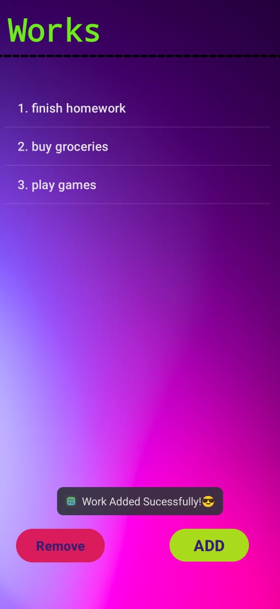

# ToDo Application 📝

An Android To-Do application developed using **Java** and **Android Studio**. This simple app allows users to manage their daily tasks efficiently with features to add and delete tasks.

## 🚀 Features

- ✅ Add new tasks
- ❌ Delete tasks
- 📋 View tasks in a list View
- 💾 Local storage using Shared Preference
- 🌓 Clean UI and responsive layout

## 📸 Screenshots

&nbsp;&nbsp;&nbsp;&nbsp;
&nbsp;&nbsp;&nbsp;&nbsp;

## 🛠️ Tech Stack

- **Language:** Java
- **IDE:** Android Studio
- **UI:** XML Layouts with ListView
- **Database:** Shared Preference

## 📦 Installation

1. Clone the repository:
   ```bash
   git clone https://github.com/hussainwaseer/todoApplication.git
Open it in Android Studio

Build and Run on Emulator or Physical Device

🤝 Contributing
Pull requests are welcome. For major changes, please open an issue first to discuss what you'd like to change.

📄 License
This project is open-source and free to use.

Developed by Muhammad Hussain Waseer
